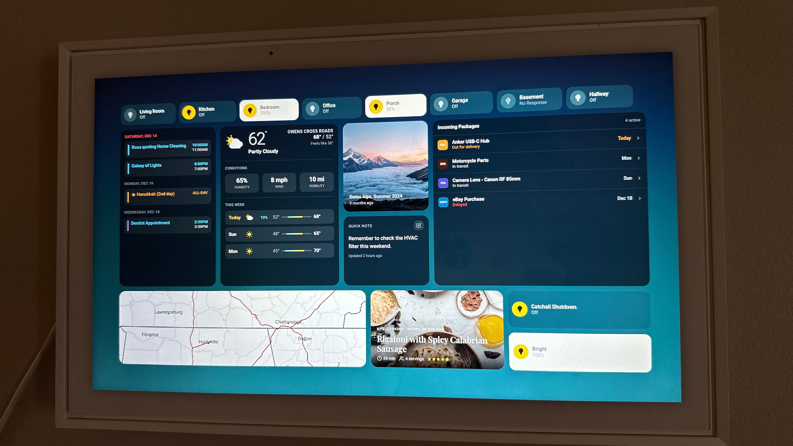

# Skylight Home Dashboard



A smart home dashboard designed for Raspberry Pi kiosk displays. Built as a web interface for a rooted Skylight Calendar, it provides real-time control of smart devices alongside weather, calendar, package tracking, and notifications.

## Features

- **Device Control** - Toggle smart lights and switches with tap; long-press for brightness
- **Weather** - Current conditions, hourly forecast, and 7-14 day outlook via Open-Meteo
- **Calendar** - Multi-calendar support with Google Calendar ICS feeds
- **Package Tracking** - Real-time shipping updates via AfterShip (UPS, FedEx, USPS, Amazon)
- **Notifications** - Persistent reminders with priority levels and WebSocket updates
- **Recipe of the Day** - Daily recipe with QR code for mobile viewing
- **Notes** - Editable notes synced with Apple Notes

## Tech Stack

**Frontend:** Vanilla HTML/CSS/JavaScript (no framework, no build step)

**Backend:** Python 3 with async HTTP/WebSocket servers

**APIs:** Kasa/Tapo (devices), Open-Meteo (weather), Google Calendar, AfterShip (shipping)

## Project Structure

```
├── index.html          # Shell, modals, SVG icons
├── app.js              # All application logic
├── style.css           # Styles with CSS variables, BEM naming
├── config.json         # Layout, devices, and API endpoints
├── skylight-service.py # Python backend service
└── config.html         # Configuration UI
```

## Configuration

Copy `config.example.json` to `config.json` and configure:
- Device IPs and types (Kasa/Tapo lights, switches)
- API endpoints (weather location, calendar URLs, AfterShip key)
- Dashboard layout (which widgets appear in each row)

## Deployment

The dashboard runs on a Raspberry Pi at `192.168.1.137`:

```bash
# Deploy frontend files
scp index.html app.js style.css config.json mira_service@192.168.1.137:~/kiosk/

# SSH and start the service
ssh mira_service@192.168.1.137
cd ~/kiosk && python3 skylight-service.py
```

## Local Development

```bash
python3 -m http.server 8080
# Open http://localhost:8080
```

## License

MIT
