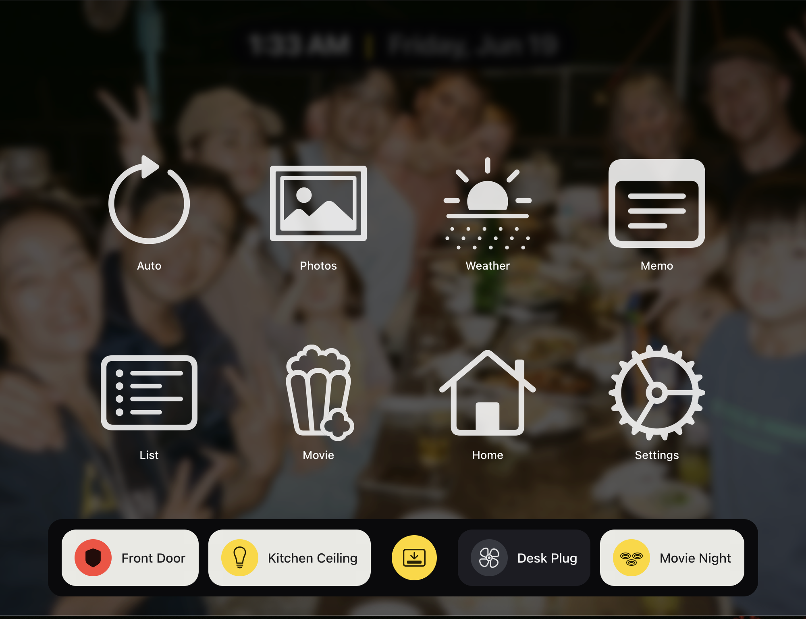

# Skylight Home



A calm-screen dashboard for a rooted Skylight Calendar, driven by a schedule and
managed from a phone via a companion admin PWA. The screen shows exactly one thing at a
time — a photo, the weather, a memo, a checklist, a movie poster, or a trash-night
reminder — chosen by the time of day.

## How it works

A **schedule** (evaluated every minute, first matching rule wins; default is the photo
frame) decides what the display shows. Content — photos, memo, list, movie — lives in a
SQLite database on the Pi and is managed remotely from the **admin PWA** (installable
on a phone). Changes propagate to the dashboard instantly over **Server-Sent Events**.

```
 ┌─────────────┐   /admin   ┌────────────────┐   SQLite   ┌──────────────┐
 │  Phone PWA  │ ─────────▶ │ FastAPI (Pi)   │ ◀────────▶ │  skylight.db │
 │ (admin UI)  │ ◀──SSE──── │  port 8894     │            └──────────────┘
 └─────────────┘            └───────┬────────┘
                                    │ serves /
                                    ▼
                            ┌──────────────────────┐
                            │ Dashboard (webview on│
                            │ Skylight Calendar)   │
                            └──────────────────────┘
```

## Screens

| Screen      | Source                          | When                                  |
|-------------|---------------------------------|---------------------------------------|
| Photos      | `/api/photos` (rotating frame)  | Default / all other times             |
| Weather     | Open-Meteo (live, hardcoded loc)| Daily 7:00–9:30                       |
| Trash Night | Static interrupt (dismissible)  | Tuesdays 17:00–23:59                  |
| Movie       | `/api/movie` (TMDB-backed)      | Wed 19:30–23:00 & Thu 17:00–23:00     |
| Memo        | `/api/memo`                     | Via admin override only               |
| List        | `/api/list-items`               | Via admin override only               |

The admin PWA can **override** the schedule to pin any screen; the override is cleared
automatically when the schedule crosses into a new 30-minute slot.

## Tech stack

- **Backend:** Python 3, FastAPI, Uvicorn, SQLite (WAL mode), httpx
  (`backend/main.py`, `backend/database.py`)
- **Dashboard:** Vanilla HTML/CSS/JS, single file — `app.js` + `index.html` + `style.css`
- **Admin PWA:** Vanilla JS PWA with service worker + web manifest (`backend/static/`)
- **External APIs:** Open-Meteo (weather, keyless), TMDB (movie search, key required)

No build step. No framework.

## Project structure

```
├── app.js                 # Dashboard logic (source of truth — copied to backend/dashboard/)
├── index.html             # Dashboard shell (clock, interrupt, dock)
├── style.css              # Dashboard styles
├── README.md
├── CLAUDE.md              # Notes for AI coding assistants
│
├── backend/
│   ├── main.py            # FastAPI app: REST API + SSE + serves dashboard & /admin
│   ├── database.py        # SQLite schema, seed data, connection helpers
│   ├── requirements.txt   # fastapi, uvicorn, httpx, python-multipart
│   ├── setup.sh           # One-time Pi setup (venv, deps, systemd install)
│   ├── skylight-backend.service   # systemd unit (user server_admin, port 8894)
│   ├── data/             # Runtime: skylight.db, photos/, posters/  (gitignored)
│   ├── dashboard/        # Deployed copy of the dashboard served at /
│   │   ├── app.js  index.html  style.css
│   │   ├── photoframe_images/   # Seed photos (gitignored)
│   │   ├── scratchpics/         # Fallback images (gitignored)
│   │   └── weather-icons/      # PNG weather icon set
│   └── static/           # Admin PWA served at /admin
│       ├── app.js  index.html  style.css  sw.js  manifest.json
│       └── icons/
```

> The dashboard files at the repo root and under `backend/dashboard/` are kept
> identical. Edit the root copies, then sync to `backend/dashboard/` (the backend
> serves only the copies under `backend/dashboard/`).

## Backend API

FastAPI on port **8894**. All mutating endpoints broadcast an SSE `update` event so the
dashboard refreshes without polling. Key endpoints:

| Method | Path                         | Purpose                                  |
|--------|------------------------------|------------------------------------------|
| GET    | `/`                          | Dashboard HTML                           |
| GET    | `/admin`                     | Admin PWA (static mount)                 |
| GET    | `/api/events`                | SSE stream (real-time push)              |
| GET    | `/api/health`                | Health check                             |
| GET    | `/api/photos`                | List photos (ordered)                    |
| POST   | `/api/photos/upload`         | Upload image (≤10MB)                     |
| PUT    | `/api/photos/reorder`        | Reorder by `{ order: [ids] }`            |
| PUT/DEL| `/api/photos/{id}`          | Update sort / delete                      |
| GET/PUT| `/api/memo`                  | Single memo (title + content)            |
| CRUD   | `/api/list-items[/{id}]`     | Checklist items                          |
| PUT    | `/api/list-items/reorder`     | Reorder items                           |
| GET/PUT| `/api/movie`                 | Single movie; posters auto-downloaded    |
| GET    | `/api/movie/search?query=`  | TMDB movie search (needs `TMDB_API_KEY`)  |
| GET/PUT| `/api/display-override`      | Pin a screen or `null` for auto          |
| GET    | `/photos/{file}` `/poster/{file}` | Serve stored images                 |

Database tables: `photos`, `memo` (singleton id=1), `list_items`, `movie`
(singleton id=1), `settings` (holds `display_override`).

## Setup & deployment

The dashboard runs on a Raspberry Pi. The backend runs as a systemd service.

**One-time setup on the Pi** (from the `backend/` directory):

```bash
bash setup.sh              # creates venv, installs deps, installs the service
sudo systemctl edit skylight-backend   # set Environment=TMDB_API_KEY=...
sudo systemctl start skylight-backend
```

**Redeploying the dashboard UI** — edit the root `app.js` / `index.html` /
`style.css`, then sync to `backend/dashboard/` and restart so FastAPI picks up
new files (StaticFiles are read per-request, so a restart is usually unnecessary
for content changes, but restart to be safe):

```bash
# from repo root, after editing the dashboard
cp app.js index.html style.css backend/dashboard/
ssh server_admin@<pi-ip> 'sudo systemctl restart skylight-backend'
```

The systemd unit (`skylight-backend.service`) runs as user `server_admin` from
`/home/server_admin/backend`. The `setup.sh` script creates the venv, installs
dependencies, copies the unit to `/etc/systemd/system/`, and enables the service.

## Local development

Run the backend with hot reload and serve everything from one origin:

```bash
cd backend
python3 -m venv .venv && source .venv/bin/activate
pip install -r requirements.txt
export TMDB_API_KEY=your_key_here        # optional, only for movie search
uvicorn main:app --reload --port 8894
```

- Dashboard: http://localhost:8894/
- Admin PWA: http://localhost:8894/admin/

To work on the dashboard UI without the backend, note that `app.js` expects the
`/api/*` endpoints and Open-Meteo; with no backend it falls back to a
"Connection Lost" interrupt. So run the backend for meaningful local testing.

## License

MIT
